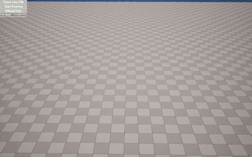



# ARTrail

[English](README.md) | [简体中文](README.zh-CN.md)

## Overview
ARTrail is a UE5.7 trail visualization project. The repository includes a runtime plugin, Blueprint/Niagara assets, sample data, and automation tests for an end-to-end workflow from data ingestion to real-time rendering.

Trail data is parsed into timestamped points, managed by a world subsystem, filtered by time window, and exposed as position/velocity arrays for gameplay logic and Niagara effects.

## Core Capabilities
- Parse trail JSON from string or file with schema validation.
- Load JSON files asynchronously to avoid blocking the game thread.
- Manage playback time, speed, and window duration in a world subsystem.
- Export current-window positions and velocities for Blueprint/Niagara.
- Support runtime UDP message intake through a threaded receiver and game-thread queue polling.
- Provide automation tests for parser behavior and subsystem window logic.

## Runtime Components
- `UARTrailSubsystem`
  - Owns trail lifecycle, playback state, window caches, and runtime updates in `Tick`.
  - Handles async loading completion and maintains sorted trail samples.
  - Exposes Blueprint APIs and events (`OnTrailsParsedFinished`).
- `UARTrailBlueprintFunctionLibrary`
  - Implements JSON parsing (file/string), input validation, and time-unit helpers.
- `FARTrailUdpReceiver`
  - Wraps socket creation/start/stop and enqueues incoming packets for safe game-thread consumption.

## Data Model
`FARTrail` fields:
- `Timestamp` (`int64`, microseconds)
- `Position` (`FVector`, centimeters in runtime; converted from meters in JSON)
- `Velocity` (`float`, meters/second)

Expected JSON schema:
```json
{
  "<timestamp_us>": {
    "position": [x, y, z],
    "velocity": 1.23
  }
}
```

## Playback and Windowing
- Current window is `[CurrentTime - TrailDuration, CurrentTime]`.
- Subsystem uses sorted timestamps and two-pointer window updates for efficient per-frame refresh.
- `SpeedRate`, `SetCurrentTime`, and `SetTrailDurationSeconds` control runtime playback behavior.

## Quick Usage
1. Open `Content/Level/ARtrailMap.umap`.
2. Keep sample data at `Content/trail-points.json` (or replace file content with the same filename/path).
3. In Blueprint, call `LoadTrailsFromJsonFileAsync("trail-points.json")`.
4. After `OnTrailsParsedFinished`, read `GetCurrentWindowArrays` and feed results into rendering logic or Niagara.
5. Use playback parameters (`bAdvanced`, `SpeedRate`, current time, duration) to control animation.

## Project Structure
```text
ARTrail/
|- Source/
|- Plugins/ARTrailRuntime/
|  |- Source/ARTrailRuntime/Public/
|  \- Source/ARTrailRuntime/Private/
|- Content/
|  |- Level/ARtrailMap.umap
|  |- Blueprints/
|  \- trail-points*.json
|- Config/
|- README.md
\- README.zh-CN.md
```

## Key Code Entry Points
- `Plugins/ARTrailRuntime/Source/ARTrailRuntime/Public/ARTrailSubsystem.h`
- `Plugins/ARTrailRuntime/Source/ARTrailRuntime/Private/ARTrailSubsystem.cpp`
- `Plugins/ARTrailRuntime/Source/ARTrailRuntime/Public/ARTrailBlueprintFunctionLibrary.h`
- `Plugins/ARTrailRuntime/Source/ARTrailRuntime/Private/ARTrailBlueprintFunctionLibrary.cpp`
- `Plugins/ARTrailRuntime/Source/ARTrailRuntime/Public/ARTrailUdpReceiver.h`
- `Plugins/ARTrailRuntime/Source/ARTrailRuntime/Private/ARTrailUdpReceiver.cpp`

## Tests
- `Plugins/ARTrailRuntime/Source/ARTrailRuntime/Private/Tests/ARTrailBlueprintFunctionLibraryTests.cpp`
- `Plugins/ARTrailRuntime/Source/ARTrailRuntime/Private/Tests/ARTrailSubsystemTests.cpp`

## Compatibility
- Target platform: Windows x64
- Engine version: Unreal Engine 5.7
